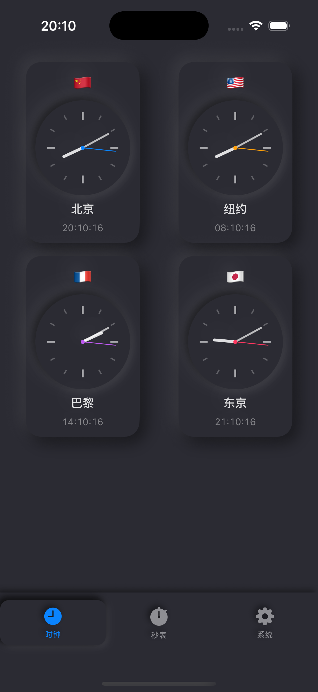
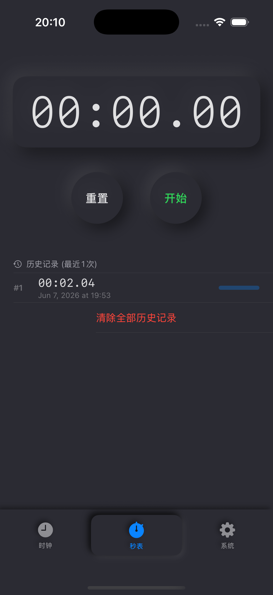
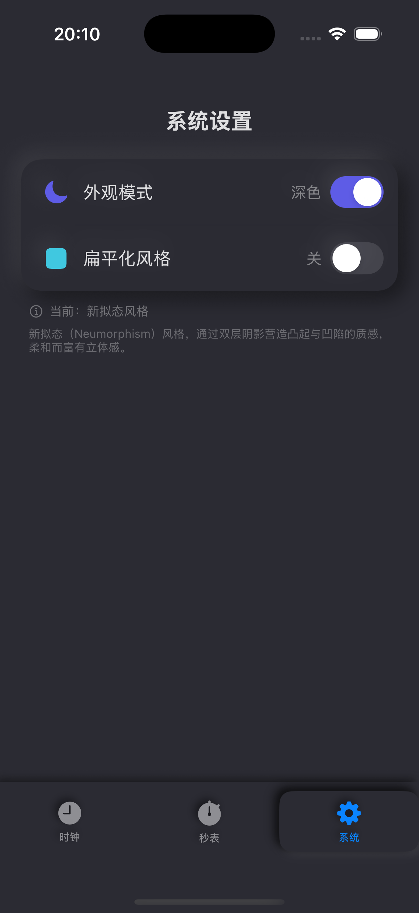

# HelloT

一款精美的世界时钟与秒表 iOS 应用，采用 SwiftUI 构建，支持新拟态（Neumorphism）UI 风格。

## 截图预览

<table>
  <tr>
    <td align="center"><b>世界时钟</b></td>
    <td align="center"><b>秒表</b></td>
    <td align="center"><b>系统设置</b></td>
  </tr>
  <tr>
    <td></td>
    <td></td>
    <td></td>
  </tr>
</table>

## 功能介绍

### 世界时钟
- 同时显示北京、纽约、巴黎、东京四个城市的模拟时钟与数字时间
- 每个城市配有国旗标识和主题色秒针，一目了然
- 点击任一时钟可展开为全屏大表盘，显示详细的数字时间、日期和时区信息
- 支持 Spring 弹性动画过渡效果

### 秒表
- 精确计时的秒表功能，支持开始、暂停和重置
- 圈速（Lap）记录，最多保存 10 次计时历史
- 历史记录带比例可视化条形图，直观对比每次计时
- 支持左滑删除单条记录或一键全部清除

### 系统设置
- **外观模式**：一键切换深色/浅色主题
- **扁平化风格**：可在新拟态和扁平化 UI 之间切换
- **新拟态风格**（默认）：通过双层阴影（左上高光 + 右下暗影）营造凸起与凹陷的立体质感

### UI 设计特色
- **新拟态（Neumorphism）风格**：柔和而富有立体感的现代设计语言
- **凸起效果**：按钮和卡片仿佛从背景中浮起
- **凹陷效果**：Tab Bar 和选中态呈现压入表面的质感
- 所有设置通过 `@AppStorage` 持久化，重启 App 不丢失

## 系统要求

- Xcode 15+
- iOS 17+

## 许可证

MIT
